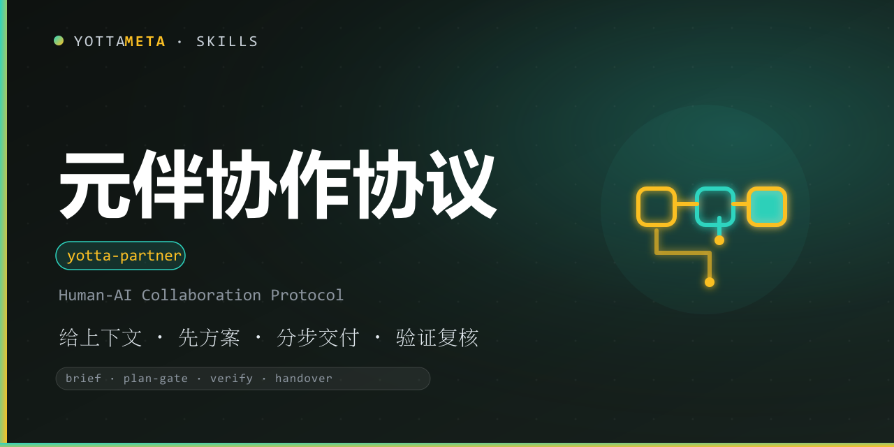

<p align="center"><b>Language</b>: English · <a href="./README.zh-CN.md">中文</a></p>

<p align="center">
  
</p>

<h1 align="center">yotta-partner · 元伴 (Yuanban)</h1>

<p align="center">YottaMeta's <b>human-AI collaboration productivity</b> skill: it converts
“how to get things done with AI” into a repeatable collaboration protocol with a context brief,
a plan-first gate, milestone delivery, verification, handover anchors and experience reuse.</p>
<p align="center">Always-load at session start; a 30-second gate decides when the full protocol is
needed, so simple questions stay simple.</p>
<p align="center">Applies automatically to complex or long-running tasks, cross-session handovers,
unreliable output, repeated rework or tasks with side effects.</p>
<p align="center">No runtime, no daemon, no network calls: the skill is a protocol plus templates that
any agent can follow on any platform.</p>
<p align="center">It is the <b>lowest common layer</b> of cross-agent collaboration: any side may keep
stricter local rules, and the stricter rule wins when they conflict.</p>

<p align="center">
  <a href="LICENSE"></a>
  <a href="https://agentskills.io/"></a>
  <a href="https://www.npmjs.com/package/@yottameta/yotta-partner"></a>
  <a href="https://github.com/YottaMeta/yotta-partner"></a>
  <a href="https://github.com/YottaMeta/yotta-partner/commits/main"></a>
  <a href="https://github.com/YottaMeta/yotta-partner"></a>
</p>

## What it is

People often fail with AI not because the AI is weak, but because the collaboration is sloppy:
no context, no plan, no verification, no memory across sessions. Yuanban turns that around with a
**repeatable collaboration protocol**:

1. **Context brief** — background, goal, constraints, acceptance criteria.
2. **Plan-first gate** — the AI proposes a plan; the user approves it before execution.
3. **Milestone delivery** — one milestone at a time, each step visible and checkable.
4. **Verification** — acceptance criteria, traceable evidence and user review, never blind trust.
5. **Handover and reuse** — leave a session anchor, save lessons, make the next session smoother.

It is not a collection of motivational tips. It is a protocol with templates that can be copied
and executed in any agent.

### Positioning

Yuanban is the **lowest common layer** of cross-agent collaboration protocols. It sets the minimum
bar for “how to get things done with AI”, so any agent or team can keep its own stricter local rules
(tighter state-file conventions, stricter release gates, higher evidence requirements). When they
conflict, the stricter rule wins.

## Core value

| Advantage | Description |
|---|---|
| **Always-load, always light** | Active from session start; a 30-second task gate prevents ceremony on simple questions |
| **Executable, not inspirational** | A fixed protocol unit: context brief, plan gate, milestones, verification, handover |
| **Works across agents** | Platform-neutral Markdown; no runtime, daemon or network required |
| **Lowest common layer** | Cross-agent minimum bar; any side keeps stricter local rules and the stricter one wins |
| **Fixes the common failure modes** | Missing context, direct action without approval, unverified output, lost session state |
| **Verifiable, not theatrical** | Acceptance criteria are checkable lists; unverified claims are labeled; evidence is real output |
| **Focuses on the human** | The user owns direction, judgment and final review; the AI handles execution and memory |
| **Compounds over time** | Lessons and effective practices are saved for the next collaboration (see yotta-learn) |
| **Honest boundaries** | Collaboration productivity only; no business, pricing or operations topics |

## Quick flow

```text
User:  I need to migrate the legacy report pipeline to the new API.
AI:    What is the background, goal, constraints and acceptance criteria?
User:  Background: monthly report depends on deprecated endpoint. Goal: switch to new API.
       Constraint: no downtime, page already has data. Acceptance: dry-run passes, one live run clean.
AI:    Plan: 1) inventory endpoint usage, 2) build adapter, 3) dry-run, 4) live switch.
       Files touched, verification steps, open questions. Shall I proceed?
User:  Approve.
```

The detailed templates live in `references/collaboration_protocol.md`; common mistakes and
fixes are in `references/faq.md`.

## Installation

Pick any of the four methods below; the order is the recommended priority. Skill files always come
from **npm** (GitHub can be slow without a proxy; npm supports mirrors).

### Method 1: npm one-liner (recommended)

```text
# Optional China mirror: npm config set registry https://registry.npmmirror.com
npx -y @yottameta/yotta-partner --agent <agent-name>   # install to the agent's default user-level skills dir
npx -y @yottameta/yotta-partner --dir <your-skills-dir> # point to the skills dir itself (e.g. ~/.codex/skills)
```

- `--agent <name>` installs to that agent's default user-level directory; `--list` shows each agent's default directory.
- `--dir <path>` installs to the given directory; for agents not in the preset list, point `--dir` at their skills directory.
- If the mirror has not synced the new package (404): add `--registry=https://registry.npmjs.org/` (a proxy may be needed in China), or wait for the mirror cache.

### Method 2: git clone (developers / git available)

```text
git clone https://github.com/YottaMeta/yotta-partner.git <your-skills-dir>/yotta-partner
```

### Method 3: GitHub Download ZIP (manual / no git)

On the GitHub repository `YottaMeta/yotta-partner`, click **Code → Download ZIP**, unzip it and put
the `yotta-partner` folder into the agent's skills directory.

### Method 4: install.sh (multi-agent one-liner script)

```text
bash install.sh --agent <name>   # install to the agent's default user-level directory
bash install.sh --dir <path>     # install to the given directory
bash install.sh --list           # list agents -> default directories
```

> Method 1 uses the npm registry (npmmirror / npmjs) and does not depend on GitHub; Methods 2/3 use
> GitHub and may fail without a proxy in China.

## License

MIT © YottaMeta — see [LICENSE](./LICENSE).
